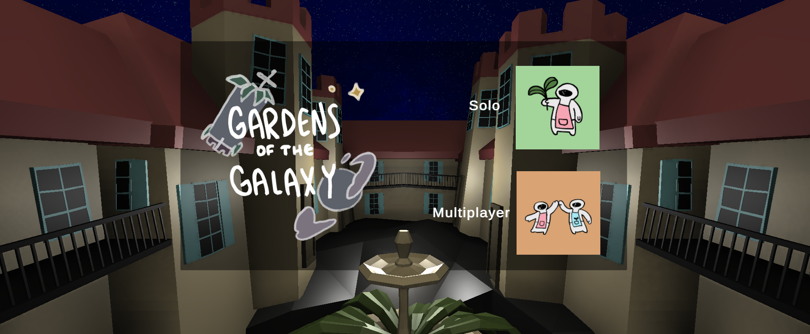
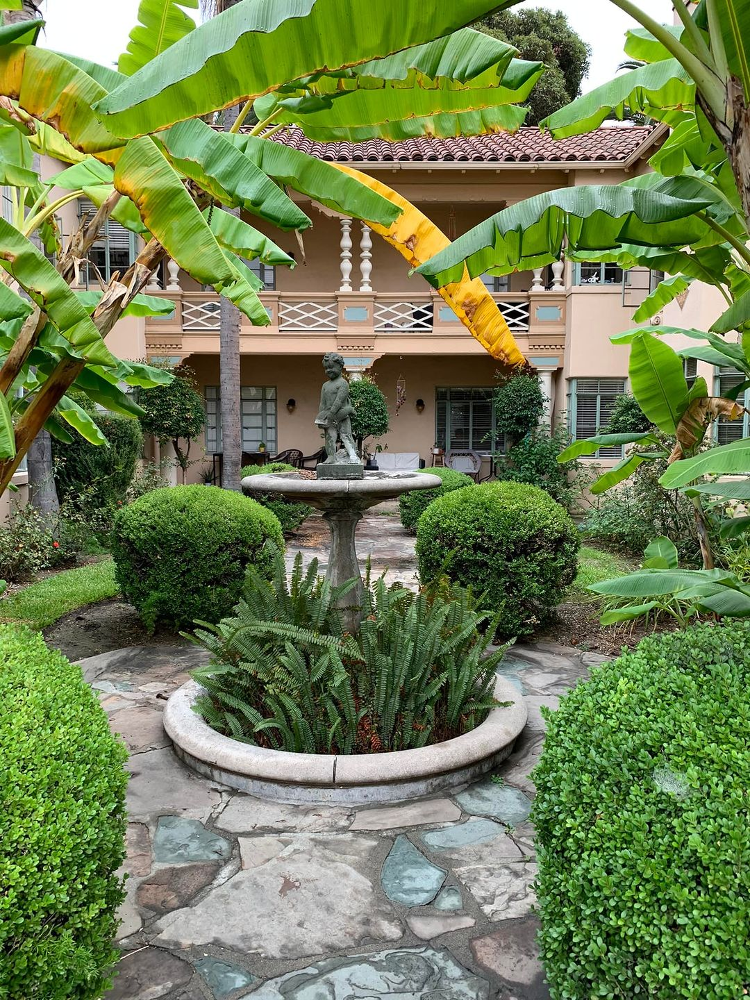

# Gardens of the Galaxy

**Gardens of the Galaxy** is a P300-based game created for the BCI Game Jam 2022: Mini Game Madness.

As a Guardian of the Gardens, explore alien worlds and compete against other Guardians in out-of-this-world minigames, including: 
- [x] **Rock, Paper, Scissors**: On the Rocky Planet of Scissored Paper, compete head-to-head on this classic game. (100%)
- [ ] **Fishing**: Avoid detection by the fishermen! (50%, No Mechanics Implementation)
- [ ] **Maze**: On the Mystery Maze Planet, make it back to the rocket together before time runs out! (80%, No BCI Control)
- [ ] **Tic Tac Toe**: On the Pineapple Planet, place three tokens in a row to win! (0%)
- [ ] **Connect Four**: On the Icicle Planet, connect four tokens in a row to win! (0%)

> **Note:** Multiplayer currently launches in single player mode.

## Controls
All standard controls from [bci-essentials-unity](https://github.com/kirtonBCIlab/bci-essentials-unity) have been included.

- **q:** Go back to the gardens

## Developer Information
- **Unity Version:** 2021.3.0
- **License:** MIT License

## The Guardians of the (OG) Garden
- [Ethan Soo](https://github.com/wingspear)
- [Katie Zhao](https://github.com/kzhao189)
- [Rylan Pozniak](https://github.com/rylan-vrar)
- [Steph Ng](https://github.com/glowcone)
- [Nicholas Pudjarminta](https://github.com/NickPudjarminta)
- [Garrett Flynn](https://github.com/garrettflynn)

P.S. It's a real place!

